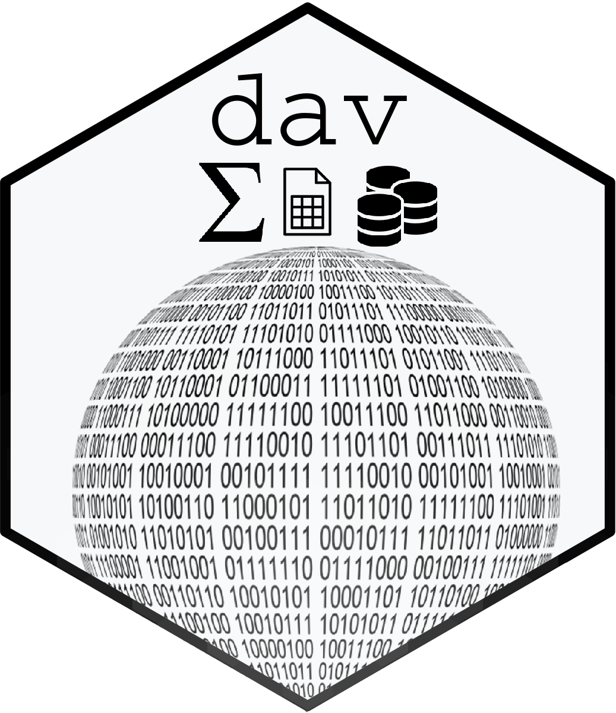

<!-- README.md is generated from README.Rmd. Please edit that file -->

# dav 

> A framework for the valuation and documentation of data assets. Make
> informed decisions on how to store, format, document, maintain,
> develop, data holdings based on domain-specific expert knowledge.

<!-- badges: start -->

[](https://lifecycle.r-lib.org/articles/stages.html#experimental)
[](https://github.com/D-Se/dav)
[](https://github.com/D-Se/dav/actions/workflows/R-CMD-check.yaml)

<!-- badges: end -->

<div id="tldr">

-   \[Get started\]\[\]
-   \[Documentation\]\[\]
-   \[Frequently asked questions\]\[FAQ\]

</div>

## :package: Installation

The package is currently **under construction :construction:**. See the
roadmap.

``` r
devtools::install_github("D-Se/dav")
```

## Usage

Basic usage is to implement a valuation based on a specification.

    dat(mtcars, ~ . + 2 * com)

Which reads as *value mtcars, using domain expert knowledge and a
specific membership function*.
